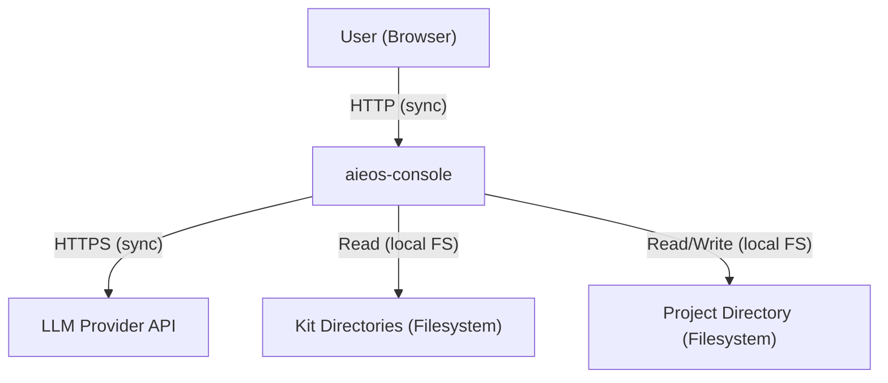
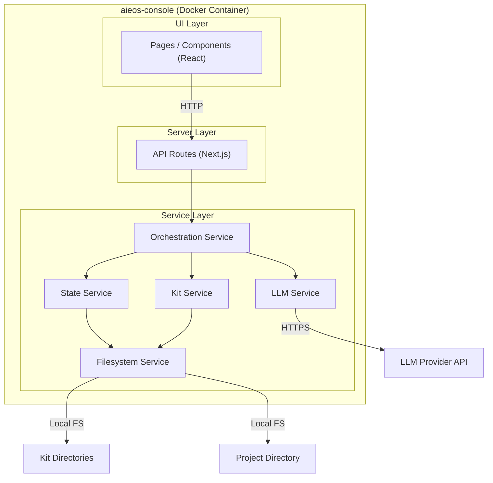
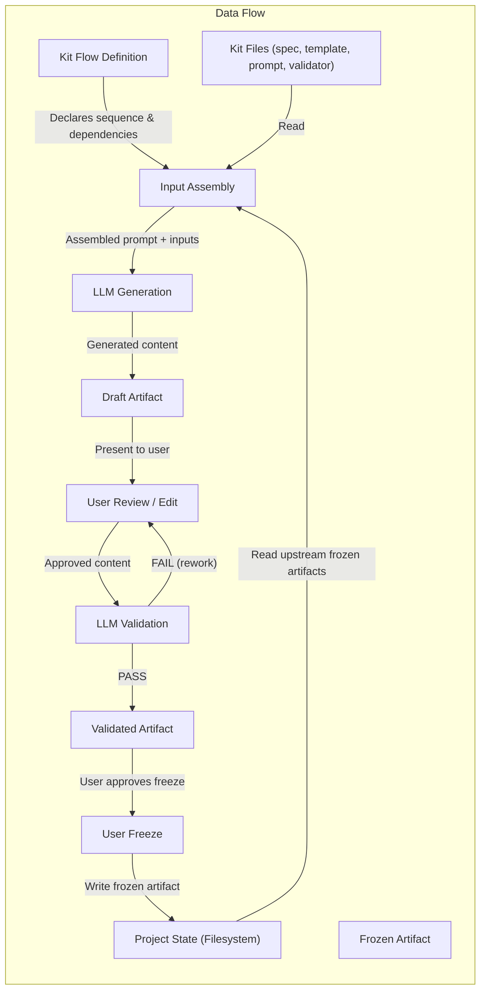

# SAD — aieos-console System Architecture Design

## 0. Document Control
- System Name: aieos-console
- SAD ID: SAD-CONSOLE-001
- Author: AI-generated, human-reviewed
- Date: 2026-03-07
- Status: Frozen
- Governance Model Version: 1.0
- Prompt Version: 1.0
- Upstream Artifacts:
  - PRD: DPRD-CONSOLE-001 (docs/sdlc/01-prd.md) — Frozen
  - ACF: ACF-CONSOLE-001 (docs/sdlc/08-acf.md) — Frozen
- Related ADRs: None

## 1. Intent Summary

- The system solves the problem of manual AIEOS process navigation: users must read 4 files per artifact type across 6 kits containing 33+ artifact types, while tracking dependencies, sequencing, and freeze state across sessions (PRD §2)
- Goal G-1: Reduce process navigation overhead so it consumes less than 20% of total artifact generation time for technical users
- Goal G-2: Enable non-technical users (product managers) to complete a PIK discovery flow independently within 60 minutes
- Goal G-3: Improve artifact quality through integrated validation, targeting ≤ 2 generation-validation-rework cycles per artifact
- Goal G-4: Enable faster AIEOS adoption evaluation — ≥ 60% of evaluators can describe the artifact flow after one guided session
- Non-goal NG-1: Kit authoring or modification is excluded — the console runs AIEOS processes, it does not build or edit kits
- Non-goal NG-2: Multi-user concurrent access is excluded — single-user operation with lock file for concurrency prevention
- Non-goal NG-3: Authentication and authorization are excluded — internal tool on trusted local network
- Non-goal NG-4: Non-happy-path flows (re-entry, escalation, cross-initiative conflict) are excluded
- Non-goal NG-5: Cloud deployment is excluded — local Docker deployment only
- Constraint C-1: The console must not hide the underlying AIEOS process from the user
- Constraint C-2: The console must not auto-complete steps without user awareness and approval
- Constraint C-3: The console must consume existing kit file structures as-is — kits do not adapt to the console

## 2. Scope and Non-Goals (Hard Boundary)

### In Scope
- Browser-based guided wizard interface for the AIEOS happy path (PIK through EEK execution)
- Artifact sequencing: Work Classification → Discovery Intake → PFD → VH → AR → EL → DPRD → PRD acceptance → ACF → SAD → DCF → TDD → WDD → Execution Plan → per-work-item execution (Tests → Plan → Code → Review) → ORD
- LLM integration for artifact generation and validation, configurable per artifact type
- Artifact state tracking (draft, validated, frozen) persisted in the project directory
- Spec-driven flow execution: kit directories provide machine-readable flow definitions that declare artifact sequencing, dependencies, and step types; the console renders and executes flows from these definitions
- Guided intake forms for human-authored artifacts (Discovery Intake, Architecture Context, Design Context)
- Rendered artifact display (formatted content, not raw markdown)
- LLM usage tracking per artifact (tokens, provider, model)
- Engagement Record maintenance as artifacts freeze
- Lock file mechanism for single-user concurrency prevention
- Project configuration (project directory, kit directory paths, LLM settings)

### Explicit Non-Goals
- **NG-1:** Kit authoring or modification — no editing of specs, templates, prompts, or validators
- **NG-2:** Multi-user concurrent access — no real-time collaboration, no shared state synchronization, no conflict resolution
- **NG-3:** Authentication and authorization — no user identity, no role-based access control
- **NG-4:** Non-happy-path flows — no re-entry after freeze, no escalation, no cross-initiative conflict resolution
- **NG-5:** Cloud deployment — no hosted infrastructure, no remote access
- Anything not listed in "In Scope" is out of scope by default

## 3. System Context (Black Box)

### Responsibilities
- Read kit-provided flow definitions and guide users through the declared artifact sequence
- Enforce freeze-before-promote dependency rules as declared in flow definitions
- Assemble artifact generation inputs (spec, template, prompt, upstream frozen artifacts) from kit directories
- Orchestrate LLM calls for artifact generation and validation
- Present generated artifacts for human review, editing, and approval
- Track and persist artifact state across sessions
- Display process transparency (active kit, artifact type, governing files)
- Track LLM usage per artifact

### External Actors / Systems
- **Users (Browser):** Technical users (UG-1) and non-technical users (UG-2, UG-3) interact via browser. Sync HTTP requests.
- **LLM Provider API:** External AI service for artifact generation and validation. Outbound sync HTTPS API calls.
- **Kit Directories (Filesystem):** AIEOS kit flow definitions and kit files (specs, templates, prompts, validators) read from configured paths. Local filesystem read access.
- **Project Directory (Filesystem):** Project artifacts and state read from and written to configured project path. Local filesystem read/write access.

### Trust Boundaries
- **Browser ↔ Server:** User input crosses trust boundary. All input validated server-side.
- **Server ↔ LLM Provider API:** LLM responses cross trust boundary. All LLM output treated as untrusted input.
- **Server ↔ Filesystem:** File paths cross trust boundary. All paths validated to remain within configured directory boundaries.

### Diagrams

## 4. High-Level Architecture (White Box)

### Major Components

- **UI Layer (Next.js Pages/Components)**
  - Responsibility: Render the wizard interface, intake forms, artifact review views, and process transparency displays. Capture user input and actions.
  - Key interactions: Receives rendered data from Server Layer via Next.js server-side rendering and client-side API calls. Sends user actions (generate, validate, freeze, edit) to Server Layer.

- **Server Layer (Next.js API Routes)**
  - Responsibility: Handle HTTP requests from UI. Orchestrate business logic by coordinating between services. Enforce request validation.
  - Key interactions: Receives requests from UI Layer. Delegates to Orchestration Service, State Service, Kit Service, and LLM Service.

- **Orchestration Service**
  - Responsibility: Execute flows defined by kit-provided flow definitions. Interpret the declared artifact sequence, enforce dependency rules (freeze-before-promote) as specified in the flow definition, and manage step progression. The Orchestration Service does not embed sequence logic — it reads the flow definition from the Kit Service and executes it generically.
  - Key interactions: Reads parsed flow definitions and artifact metadata from Kit Service. Reads artifact state from State Service. Triggers LLM Service for generation and validation. Updates state via State Service.

- **Kit Service**
  - Responsibility: Read and parse kit-provided flow definitions and kit directory structures. Resolve artifact types, their four-file sets (spec, template, prompt, validator), and the declared flow sequence from each kit's flow definition file. Provide parsed flow definitions and kit metadata to Orchestration Service and UI Layer.
  - Key interactions: Reads kit directories and flow definition files via Filesystem Service. Provides parsed flow definitions and file content to Orchestration Service. Provides flow structure to UI Layer for rendering.

- **State Service**
  - Responsibility: Manage artifact state (draft, validated, frozen) and project configuration. Provide the service layer abstraction for all state access. Track LLM usage per artifact.
  - Key interactions: Reads/writes project directory via Filesystem Service. Provides state to Orchestration Service and UI Layer.

- **LLM Service**
  - Responsibility: Manage LLM provider integration through a provider abstraction. Assemble prompts with inputs, send requests, and return responses. Track token usage.
  - Key interactions: Receives generation/validation requests from Orchestration Service. Makes outbound HTTPS calls to configured LLM provider. Returns responses to Orchestration Service.

- **Filesystem Service**
  - Responsibility: Provide the single interface for all filesystem operations. Enforce path boundary validation. Implement atomic write patterns. Manage lock file.
  - Key interactions: Used by Kit Service, State Service. Reads/writes to kit directories and project directory on the host filesystem.

### Communication Patterns
- Sync request/response: All communication between UI and Server Layer is synchronous HTTP
- Internal service calls: In-process function calls (all services run within a single Node.js process)
- LLM API calls: Synchronous outbound HTTPS with response streaming where supported by the provider

### Diagrams

## 5. Key Architectural Decisions

- **Decision: Single Node.js process with in-process service calls**
  - Rationale: The system is single-user, locally deployed. A single process eliminates inter-process communication complexity without sacrificing any requirements. Aligns with simplicity constraint and local deployment model (PRD NG-2, NG-5; ACF §2).
  - Alternatives considered: Separate backend API service + frontend SPA; microservice decomposition
  - Consequences: All services share a single process; no network overhead for internal calls; scaling to multi-user would require architectural revision (acknowledged via NG-2)

- **Decision: Service layer abstraction for all state access**
  - Rationale: NFR-4 requires that state access go through a service layer to enable future replacement of file-based storage with database-backed storage. ACF §8 forbids direct filesystem access from business logic.
  - Alternatives considered: Direct filesystem access from business logic (rejected — violates NFR-4 and ACF)
  - Consequences: All filesystem operations are isolated behind service interfaces; business logic is decoupled from storage mechanism

- **Decision: Provider abstraction for LLM integration**
  - Rationale: NFR-5 requires support for additional LLM providers without structural changes. ACF §7 mandates provider abstraction. PRD C-4 requires multi-provider architecture even though initial release targets a single provider.
  - Alternatives considered: Direct integration with a single provider SDK (rejected — violates NFR-5 and C-4)
  - Consequences: New providers can be added by implementing the provider interface; initial implementation targets one provider

- **Decision: Spec-driven flow execution via kit-provided flow definitions**
  - Rationale: NFR-3 requires that kit changes do not require console code changes. ACF §8 forbids hardcoded kit structure. Dynamic file discovery alone is insufficient — if the artifact *sequencing* is embedded in the Orchestration Service, the hardcoding is merely moved one layer deeper. By requiring each kit to provide a machine-readable flow definition that declares the artifact sequence, step types (LLM-generated, human intake, acceptance check), dependencies, and freeze gates, the console becomes a generic flow renderer and executor. Kit authors own their flows entirely.
  - Alternatives considered: (1) Hardcoded artifact type registry (rejected — violates NFR-3 and ACF); (2) Dynamic file discovery with embedded sequence logic in Orchestration Service (rejected — does not fully satisfy NFR-3 because adding or reordering artifacts in a kit would still require console code changes)
  - Consequences: Kit directories must include a flow definition file. The UI renders itself from the parsed flow definition. The Orchestration Service executes flows generically without kit-specific logic. Any kit can define its own wizard flow without console code changes. This also enables future extensibility — a CLI, agent, or other interface could read the same flow definitions.

- **Decision: Next.js with server-side rendering**
  - Rationale: Provides a unified React-based framework for both server and client rendering, reducing the need for a separate API server. Server-side rendering enables initial page loads with complete data. Aligns with the single-process architecture decision.
  - Alternatives considered: Separate Express API + React SPA (more infrastructure complexity); static site generator (insufficient for dynamic LLM interactions)
  - Consequences: Single framework for UI and API; server components can access filesystem and services directly; client components handle interactive wizard state

## 6. Cross-Cutting Concerns (Architectural Handling)

### Security
- **Trust boundaries:** Three trust boundaries exist (see §3): browser ↔ server, server ↔ LLM provider, server ↔ filesystem
- **Browser ↔ server boundary:** All user input is validated server-side before processing. Client-side validation is supplementary. Form inputs are constrained by type, length, and allowed values. File path inputs are validated to resolve within configured directory boundaries (ACF §3 path traversal prevention).
- **Server ↔ LLM boundary:** LLM responses are treated as untrusted input. Content rendered in the browser is sanitized to prevent XSS. LLM output is not used for path construction, shell commands, or executable code without validation (ACF §3 LLM response handling).
- **Server ↔ filesystem boundary:** All filesystem access goes through the Filesystem Service, which validates that resolved paths remain within configured project and kit directory boundaries. Symlink resolution is validated before access.
- **Secrets:** LLM API keys are provided via environment variables or a secrets configuration file excluded from version control. Secrets never appear in logs, artifacts, or browser-rendered content (ACF §3 secret management).
- **Authentication/authorization:** Not implemented (PRD NG-3). No trust boundary between users — all browser clients are treated as the single authorized user.

### Reliability and Resilience
- **LLM provider failure isolation:** LLM API failures do not corrupt local state. The Orchestration Service treats LLM calls as fallible operations — failure results in user notification with the ability to retry, not state corruption. No partial writes to the project directory occur during LLM operations.
- **Filesystem write isolation:** The Filesystem Service uses atomic write patterns (write to temporary file, then rename) to prevent partial or corrupted artifact files. A failure during write does not leave artifacts in an inconsistent state.
- **Frozen artifact immutability:** Once an artifact is frozen, the State Service prevents modification. Frozen artifacts are not affected by failures in downstream artifact generation.
- **Lock file for concurrency:** The Filesystem Service acquires a lock file on startup and releases on shutdown. If a lock file already exists, the application notifies the user and does not proceed, preventing concurrent state modification.

### Observability
- **Structured application logs:** JSON-formatted logs with contextual identifiers (request ID, artifact ID, step ID). Emitted at application startup/shutdown, on each user action, and on errors.
- **LLM usage metrics:** Per-artifact tracking of tokens consumed, provider used, model used, and request duration. Stored in the project directory via State Service.
- **Artifact state transitions:** Logged on each state change (draft → validated → frozen) with timestamp and artifact ID.
- **Validation results:** Logged with PASS/FAIL status, gate details, and completeness score.

### Performance and Scale
- **Single-user model:** The system is designed for one concurrent user. No architectural mechanisms for horizontal scaling or concurrent request handling beyond Node.js default behavior.
- **LLM latency:** LLM API calls are the dominant latency contributor. The architecture supports response streaming from the LLM provider to the browser, allowing users to see generation progress rather than waiting for complete responses.
- **Kit directory caching:** Kit structure metadata may be cached in memory after initial directory scan, invalidated on configuration change or explicit refresh. This is a deferred decision (see §11).

## 7. Data and Integration

### Data Stores

- **Project Directory (Filesystem)**
  - Ownership: State Service (authoritative owner for all writes)
  - Access pattern: Read/write. State Service writes artifact files, state metadata, LLM usage logs, and lock file. Orchestration Service reads artifact content and state through State Service. Kit Service does not write to the project directory.
  - Contents: Generated artifacts (markdown), artifact state metadata, project configuration, LLM usage records, Engagement Record, lock file

- **Kit Directories (Filesystem)**
  - Ownership: External (read-only to aieos-console)
  - Access pattern: Read-only. Kit Service reads flow definition files, kit file structures, specs, templates, prompts, and validators. No aieos-console component writes to kit directories.
  - Contents: Flow definition file (machine-readable, declares artifact sequence, step types, dependencies, and freeze gates); AIEOS kit files organized by the four-file system (spec, template, prompt, validator per artifact type)

### Integration Patterns

- **LLM Provider API:** Request/response over HTTPS. The LLM Service sends assembled prompts (system prompt + user content from spec, template, prompt, and upstream artifacts) and receives generated text. The provider abstraction normalizes request/response format across providers.
- **Filesystem:** Direct local filesystem access through the Filesystem Service. No network filesystem protocols. Path boundaries enforced on every operation.

### State Transitions

Artifacts transition through a defined lifecycle managed by the State Service:

1. **Not Started** → **In Progress**: User initiates a step; Orchestration Service confirms upstream dependencies are frozen
2. **In Progress** → **Draft**: LLM generates artifact content; State Service persists as draft
3. **Draft** → **Validated (PASS)**: LLM validator returns PASS; State Service records validation result
4. **Draft** → **Validated (FAIL)**: LLM validator returns FAIL; user reviews issues and edits; returns to Draft for re-validation
5. **Validated (PASS)** → **Frozen**: User explicitly approves freeze; State Service writes final artifact and updates Engagement Record
6. **Frozen**: Terminal state within the happy path. Frozen artifacts are immutable and serve as inputs for downstream artifact generation.

## 8. Failure Modes and Recovery

| Failure Mode | Impact | Detection | Mitigation |
|-------------|--------|-----------|------------|
| LLM provider API unavailable | User cannot generate or validate artifacts; previously frozen artifacts remain accessible | LLM Service detects HTTP error or timeout on API call | Orchestration Service surfaces error to user with retry option. No state change occurs on failure. Application remains functional for reviewing existing artifacts. |
| LLM provider returns malformed response | Generated artifact may be incomplete or unparseable | LLM Service validates response structure before passing to Orchestration Service | Orchestration Service presents error to user. Draft is not persisted if response is unparseable. User can retry generation. |
| Filesystem write failure (disk full, permissions) | Artifact state change fails to persist | Filesystem Service detects write error from OS; atomic write pattern prevents partial writes | Error surfaced to user. No state transition occurs. Previous state remains consistent due to atomic write pattern. |
| Kit directory missing or unreadable | Application cannot determine artifact flow or assemble generation inputs | Kit Service detects missing directory, missing flow definition, or unreadable files on startup or first access | Application surfaces configuration error to user. No artifact generation proceeds until kit directories and flow definitions are accessible. |
| Kit flow definition is malformed or invalid | Application cannot determine artifact sequence for the affected kit | Kit Service validates flow definition structure on parse; reports specific validation errors | Application surfaces parse error to user identifying the kit and the issue. Other kits with valid flow definitions remain usable. |
| Lock file already exists on startup | Application cannot acquire exclusive access; potential concurrent user | Filesystem Service checks for lock file on application initialization | Application notifies user that another instance may be running. Does not proceed without lock acquisition. |
| Project directory contains corrupted state metadata | Artifact state may be inconsistent with actual artifact files | State Service validates state metadata consistency on load | State Service reports inconsistency to user. Affected artifacts may need manual inspection. State can be reconstructed from artifact files in the project directory (ACF §5 rollback expectation). |
| LLM response contains malicious content (prompt injection) | XSS or unintended behavior if rendered unsanitized | Content sanitization layer in UI rendering pipeline | All LLM-generated content is sanitized before browser rendering. Content is never used for path construction or code execution without explicit validation (ACF §3). |

## 9. Quality Attribute Scenarios (QAS)

| Quality Attribute | Scenario | Response | Measure |
|------------------|----------|----------|---------|
| Availability | LLM provider API becomes unreachable during artifact generation | System notifies user of the failure, preserves all existing state, and allows retry when provider recovers | No data loss; previously frozen artifacts remain accessible; user can retry without re-entering data |
| Performance | User initiates artifact generation for a complex artifact (e.g., SAD) | System streams LLM response to browser as it is generated, providing progressive feedback | User sees generation progress within 3 seconds of initiating the request; full response rendered as it completes |
| Security | LLM response contains a script tag or path traversal sequence | Content sanitization prevents XSS; path validation prevents filesystem escape | No unsanitized LLM content reaches the DOM; no filesystem access outside configured boundaries |
| Reliability | Application crashes mid-write during artifact freeze | Atomic write pattern ensures either the complete artifact is written or the previous state is preserved | On restart, artifact state is consistent — either the new frozen state or the previous validated state, never partial |
| Usability | Non-technical user navigates to the next step after freezing an artifact | Orchestration Service automatically determines the next step in the sequence and presents it with context about what will happen | User sees which step is next, which kit/artifact type is involved, and what inputs are being assembled — without needing to consult AIEOS documentation |
| Maintainability | A new AIEOS kit adds a new artifact type to an existing kit | Kit author updates the kit's flow definition file to include the new step; Kit Service reads the updated flow definition on next load | No console code changes required; new artifact type appears in the guided flow after restart; UI renders the new step from the flow definition |

## 10. Constraints and Guardrails (from ACF)

- **Service layer abstraction:** All state access goes through the State Service interface; business logic does not access the filesystem directly (ACF §7, §8)
- **Provider abstraction:** LLM integration uses a provider interface; adding providers does not require structural changes (ACF §7)
- **Path traversal prevention:** All filesystem operations validate resolved paths against configured directory boundaries (ACF §3)
- **No hardcoded kit structure:** Artifact types and sequencing are declared in kit-provided flow definitions and read dynamically; no sequence logic is embedded in console code (ACF §8)
- **No automatic step completion:** All generation, validation, and freeze actions require explicit user initiation (ACF §8)
- **LLM response as untrusted input:** Generated content is sanitized before rendering and validated before filesystem writes (ACF §3, §8)
- **Secrets protection:** API keys never appear in logs, artifacts, or rendered content (ACF §3, §8)
- **Unpinned dependencies forbidden:** All dependencies version-pinned to exact versions (ACF §8)
- **Atomic writes:** Filesystem writes use write-then-rename to prevent partial state (ACF §5)
- **Structured logging:** JSON-formatted logs with contextual identifiers (ACF §6)
- **Dependency vulnerability posture:** No known high or critical CVEs in production dependencies (ACF §3)
- **Cryptography:** TLS 1.2+ for outbound connections; no custom crypto; no deprecated algorithms (ACF §3)

## 11. Deferred Decisions (Explicit)

- **Flow definition file format and schema:** The specific file format (YAML, JSON, TOML), schema, and vocabulary for kit-provided flow definitions. The flow definition must declare artifact sequence, step types (LLM-generated, human intake, acceptance check), upstream dependencies, freeze gates, and four-file references. Deferred because the schema should be informed by analysis of existing kit playbooks (which already contain this information in prose form). Target resolution: TDD phase.

- **Kit directory caching strategy:** Whether and how to cache kit directory metadata and parsed flow definitions in memory after initial scan. Deferred because cache invalidation strategy depends on usage patterns observed during development. Target resolution: TDD phase.

- **LLM response streaming implementation:** Whether to use server-sent events, WebSocket, or chunked HTTP response for streaming LLM output to the browser. Deferred because the choice depends on Next.js capabilities and LLM provider SDK support. Target resolution: TDD phase.

- **Artifact state storage format:** The specific file format and directory structure for persisting artifact state metadata within the project directory. Deferred because this is implementation detail within the State Service abstraction. Target resolution: TDD phase.

- **Content sanitization approach:** The specific mechanism for sanitizing LLM-generated content before browser rendering (library selection, sanitization rules). Deferred because this is implementation detail within the UI Layer. Target resolution: TDD phase.

- **Lock file implementation details:** The specific lock file format, staleness detection, and cleanup mechanism. Deferred because this is implementation detail within the Filesystem Service. Target resolution: TDD phase.

## 12. Risks and Assumptions

### Risks

- **Risk: Kit structure assumptions may be incorrect**
  - Impact: If kit directory structures do not follow a consistent pattern (e.g., inconsistent naming, missing files, unexpected nesting), the Kit Service cannot reliably discover artifact types and their four-file sets.
  - Mitigation: Kit Service reads structure dynamically and validates expected file patterns. Missing or inconsistent files are reported to the user rather than causing silent failures. The NFR-3 dynamic reading approach inherently tolerates structural variation.

- **Risk: LLM output quality varies significantly across artifact types**
  - Impact: Complex artifacts (SAD, TDD, WDD) may require more generation-validation-rework cycles than simpler artifacts, potentially exceeding the G-3 target of ≤ 2 cycles.
  - Mitigation: The architecture supports iterative generation with user editing between cycles. The validation loop is a core architectural pattern, not an exception path. Per-artifact LLM configuration (FR-9) allows selecting more capable models for complex artifacts.

- **Risk: Single-process architecture limits future extensibility**
  - Impact: If multi-user support (NG-2) is later required, the single-process architecture would need significant revision.
  - Mitigation: Service layer abstraction (NFR-4) isolates state access from business logic. Services can be extracted to separate processes in the future because they communicate through defined interfaces, not shared in-process state.

### Assumptions

- **Assumption: Kit directories provide valid flow definitions** — Each kit directory includes a machine-readable flow definition file that declares the artifact sequence, step types, dependencies, and freeze gates, alongside kit files organized with consistent naming conventions (spec, template, prompt, validator per artifact type). If false: The console cannot render or execute the kit's flow; kit authors would need to create flow definitions before the console can operate on their kit.

- **Assumption: A single Node.js process can handle LLM response streaming and UI rendering without performance degradation for a single user** — The system does not require worker processes or background job queues for artifact generation. If false: Architecture would need to add a worker process for LLM calls.

- **Assumption: Atomic filesystem writes (write-then-rename) are sufficient for state consistency** — No transaction log or WAL is needed for a single-user, single-process system. If false: State Service would need a more sophisticated persistence mechanism.

## 13. Freeze Declaration (when ready)
This SAD is approved and frozen. Downstream artifacts may not reinterpret or expand this architecture.

- Approved By: Initiative Owner
- Date: 2026-03-08
